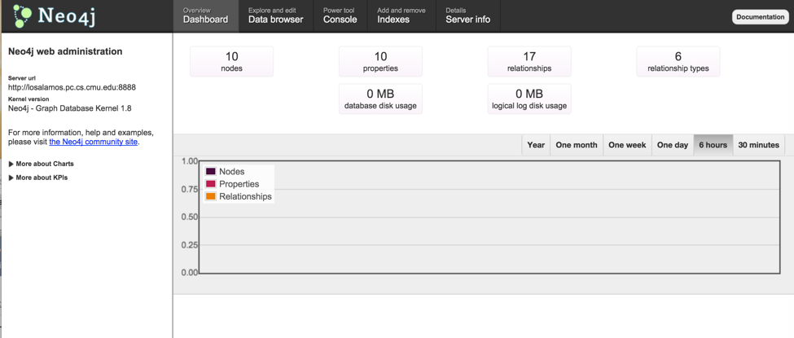

# Instructions for installing Neo4j
While installing Neo4j, you might make use of [this](http://neo4j.com/docs/stable/ha-setup-tutorial.html) and [this](https://dzone.com/articles/setting-neo4j-cluster-amazon) instructions.

You need to go through most of the following steps on four machines, we will take losalamos for example.

### Steps

- Login to the losalamos server and then update and install java:
```
sudo apt-get update
install java
```
- Download and install Neo4j Enterprise edition and rename the directory to "neo4j".
```
wget http://dist.neo4j.org/neo4j-enterprise-1.8-unix.tar.gz
tar -xvzf neo4j-enterprise-1.8-unix.tar.gz
```
- Setting the file limits to 90000 for the ubuntu user.
```
ulimit -n 90000
```
- Configure Neo4j to use it. Edit `neo4j/conf/neo4j.properties` and `neo4j/conf/neo4j-server.properties` files based on [this](https://dzone.com/articles/setting-neo4j-cluster-amazon) instructions. Make sure you modified `ha.server_id`, `ha.coordinators`, `ha.server` sections.
- Setup the 3 coordinators, one for each of the ec2 instances we’ll spin up by replacing the entries in **coord.cfg** to match the entries below:
```
neo4j/conf/coord.cfg:

server.1=ip address
server.2=ip address
server.3=ip address
server.4=ip address
```
- Set the Zookeeper coordinator ids on each instance:
```
On instance 1:
echo '1' > myid   
On instance 2:
echo '2' > myid
On instance 3:
echo '3' > myid
```
- Start the coordinators on all 3 instances:
```
neo4j/bin/neo4j-coordinator start
```
- Finally start Neo4j on all 3 instances (using the no-wait option):
```
neo4j/bin/neo4j start-no-wait
```
It will shows:
```
Starting Neo4j Server...WARNING: not changing user
process [2213]...Started the server in the background, returning...
```
- Now, you can check the following page and make use of Neo4j!
```
http://ip-address:port
```

# Instructions for running Neo4j

After you get on the Neo4j web adminstration, you will see the similar view as following (There should be 0 for nodes, properties and relationships if you login for the first time):

And [this link](https://www.youtube.com/watch?v=bqvDSioHYq8) can give you a basic idea about how to take use of this webadmin.

There are four sections that might be useful:

- Dashboard:
You can get overall information such as how many nodes, properties and relationships of your db.
To the right are charts that show the total number of primitive entities in the database over time. You can select the timespan to show with the links in the top right corner of the chart. To get specific info of some point in any chart, simply hover the mouse over the chart line.

- Data browser:
In this section, you can create nodes, relationships using the top right bottoms, and set properties on each node, and you can use Cypher query language ([this](http://neo4j.com/docs/1.8/cypher-query-lang.html) can help you with Cypher syntax) for working with your data, and click top right bottom "switch view mode" to view your data in graph view mode.

- Console:
The Neo4j Shell, allows you to use the Cypher query language for working with your graph, as well as other powerful shell features.
After you create nodes in your db, you could test this part with some basic Cypher queries:
```
-- Get node with id 0
START a = node(0)
RETURN a;

-- Get all nodes connects to node with id 0
START a = node(0)
MATCH a-->b
RETURN b;

-- Get all nodes connected to node with id 0, and the relationships
START a = node(0)
MATCH a-[r]->b
RETURN r, b;
```
[Here](http://console.neo4j.org/) is an example of Neo4j console.

- Indexes:
This interface lets you list, create and remove indexes from your database.
Note that index creation here is provided for testing purposes, and is only capable of creating default indexes. To create indexes with more complex configurations, please use your Neo4j REST client of choice.
Note: You can query your indexes through the data browser, see "syntax help" below the search bar there.

For more information, you can refer to [link1](https://www.youtube.com/watch?v=UJ81zWBMguc&list=PLAWPhrZnH759YHRieMBzsQRvr56JcYx5l), [link2](https://www.youtube.com/watch?v=tyNWT85Z0mc).
