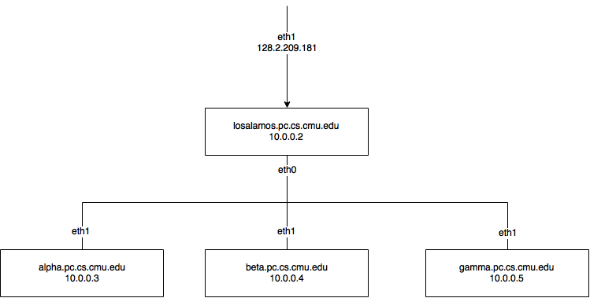

__!!!NO USERNAME, PASSWORD HERE!!!__

* [Hadoop Cluster Requirements](#requirement)
* [Knowledge Background](#knowledge)
* [Notes About Hardware](#hd)
* [Steps to Follow](#step)
    - [Install Ubuntu](#install-ubuntu)
    - [Establsh Subnet](#install-subnet)
    - [Iptables](#iptables)
    - [Install Hadoop using Ambari](#install-hadoop)
    - [Test a MapReduce Program](#test-mapreduce)
* [Pitfalls](#pitfall)
* [How to Re-create the Cluster](#recreate-cluster)
* [Basic Network Troubleshooting](#troubleshoot)

# <a name="requirement">Hadoop Cluster Requirements</a>
- OS: CentOS 7/ Ubuntu 14.04
- Network Structure: NAT, Losalamos need to be the NAT server. Losalamos can be connected to the port on wall through "eno2".
- Install Choice: [Link to installation]( http://docs.hortonworks.com/HDPDocuments/Ambari-2.2.0.0/bk_Installing_HDP_AMB/bk_Installing_HDP_AMB-20151221.pdf)
- You need to install 'HDFS','MapReduce2','Yarn', 'Ambari Metrics' and you must install the package we are currently learning.
- You must keep a wiki of the necessary steps you think may be helpful to the next group here. Change of the wiki also is part of the grading.
- You have 3 whole days minus 2h for grading from 1:00 PM the first day to 11:00 AM the last day.


#Grading Criteria (30')
##Wiki (10')
- Beyond expectation, more than TA would write (12')
- Meet expectation (10')
- Basically meet expectation, missing some points that TA think is necessary for other groups (8')
- Below expectation (6')
- Less than 10 lines of wiki added/Modified, or modification makes no sense (2')

## Self designed demo with scripts to run without any intervention (10')
- Beyond expectation, test some points that TA would not think of (12')
- Meet expectation (10')
- Basically meet expectation (8')
- Below expectation, there are some essential points are not tested (6')
- Demo does not work will add another 3 points penalty on the previous grade.
- Demo requires TA intervention will add 1~2 points penalty on the previous grade depending on the time spend on intervention.

## Other (10')
- Iptables is up on losamalos and has basic protection with minimum iptables (2')
- Primary Name Node and Data Nodes should be on separate machines. (2')
- Primary Name Node and Secondary Name Nodes should be on separate machines. (2')
- NAT test, get google home page on other three machines. (2')
- Strong Password, password including at least a number and a letter and longer than 6 characters (2')
- No Alert in Ambari. (1' each alert, 2' max)

### Minimum Iptables
```
target     prot opt in     out     source               destination
ACCEPT     all  --  any    any     anywhere             anywhere             ctstate RELATED,ESTABLISHED
ACCEPT     all  --  lo     any     anywhere             anywhere
ACCEPT     icmp --  any    any     anywhere             anywhere
REJECT     all  --  any    any     anywhere             anywhere             reject-with icmp-host-prohibited
```

# <a name="knowledge">Knowledge Background</a>
- Ubuntu Command Line, Network Config (hostname, hosts, etc)
- Basic Computer Network knowledge, like DNS, Subnet (IP, Mask), Gateway;
- SSH, NAT, Forwarding
- Hadoop structure
- Basic understanding of above topics would make this work much easier

# <a name="hd">Things about hardware you should know</a>
- There are four servers to set up, but only the first one (Losalamos) has access to the Internet;
- The box connecting the servers is just a switch, not a router. So “forwarding” is needed to get the other three servers connected to the Internet;
- Every server has two network adapters, “eth0” and “eth1”, and it can only connects to the Internet by “eth1”. So please double-check the connection ports;
- Since “Losalamos” uses “eth1” to connect to the Internet, it should use “eth0” for the sub network.

<hr>


# <a name="step">Steps to Follow</a>

Overview: Given four blank server, we need to install system and establish a subnet. Finally install the requested hortonwork components. The network should be built as this image



## <a name="install-ubuntu">Install Ubuntu</a>

Install Ubuntu (recommend 14.04) on each machine. The hard disks of four machines should already be erased. If not, press F11 when the system is starting and choose to start from the CD rom.

It may be hard to create a bootable USB stick on mac OS X. Failures occured for the following two approaches:
1. burn by command `dd` [[ref]](http://www.ubuntu.com/download/desktop/create-a-usb-stick-on-mac-osx)
2. burn by UNetbootin [[ref]](http://unetbootin.github.io/) Please update if there are methods that work. A convenient method is to install Ubuntu from CD (the CD is already provided, you can find it near the machines).

In the image above, the three innet machines' hostname are `alpha`, `beta` and `gamma`. You can change them to whatever you like.

During the installation, we need configured network of `losalamos` with eth1 and we don't need to configure the network of three innet machines during the install process. Thus when installing Ubuntu on the three innet machines, it will show "network autoconfiguration failed", just ignore and continue.

[Here](https://www.youtube.com/watch?v=P5lMuMhmd4Q) is a step-by-step installation video.

`losamalos` should have access to the internet already after installation. Using `ping google.com` or `ping + other known IP address` to check the connection.

## <a name="install-subnet">Establish Subnet</a>

1. Connect servers physically, through the switch and network adapter ports on each machine. Usually this step has already been done.
2. Start from the `losamalos` Up the `eth0` network of `losalamos`. using command `sudo ifconfig eth0 up`
3. Configure `eth0` in the file `/ect/network/interfaces` with `static ip = 10.0.0.2`, `netmask 255.255.255.0`, `gateway 10.0.0.2`, and `broadcast 10.0.0.255`. You can find an example [here](https://wiki.debian.org/NetworkConfiguration), in the **Configuring the interface manually** section.
4. There are two ways to setup connection between `losamalos` and the other threes machine `alpha`, `beta` and `gamma`.

* Using DHCP
> * Set up a DHCP server on `losalamos` first. [Here](https://www.youtube.com/watch?v=9Vc6-0smd64) is a video tutorial about how to set up a DHCP server on Ubuntu server. Be carefule about compatability. The system we install is Ubuntu 14.01. So download the version of DHCP server which is compatable with our system. The DNS server of CMU are [here](https://www.cmu.edu/computing/partners/dept-computing/services/domain.html) And you cancheck [this](http://askubuntu.com/questions/140126/how-do-i-install-and-configure-a-dhcp-server) for DHCP configuration.
> * Switch to innet machines, up the `eth1`, and set up each `eth1` to `dhcp`. You can check this [page](http://inside.mines.edu/CCIT-NET-SS-Configuring-a-Dynamic-IP-Address-Debian-Linux) to help.

* Using staic IP
> * No need to set up DHCP server on `losalamos`. Go straight to innet machines and set up the static IP to the three innet machine as the image above. This [page](https://help.ubuntu.com/14.04/serverguide/network-configuration.html) can help you to set up the static ip, you need to set the `address`(staic ip),`netmask`(255.255.255.0),`gateway`(the static IP of losamalos) and`dns-nameservers`(128.2.184.224) in the file `/etc/network/interfaces`

5. After making the configurations above, remember the configurations will take effect only after 1) you reboot the machine **OR** 2) shut down port using `sudo ifdown eth1` and then restart using `sudo ifup eth1`. 
6. You should be able to ping each other now using ip.
7. Edit `/etc/hosts` files on four machines, telling them the connections between ip and domain and hostname. This [page](http://linux.die.net/man/5/hosts) can guide you how to set up.
8. You should be able to ping each other now using domain or hostname

## <a name="iptables">Iptables</a>


For now, the machines in the subnet are unable to connect the real internet. This is because the gateway does not forward their tcp/udp requests to the outside world. Thus we use `iptables` to tell gateway forwarding them. [This page](http://www.revsys.com/writings/quicktips/nat.html) is enough as a HOWTO wiki. If you want to know more about forwarding, check [this](http://www.howtogeek.com/177621/the-beginners-guide-to-iptables-the-linux-firewall/). After configuring iptables, all four machines should be able to connect to the Internet now, you can try to ping www.google.com on all four machines to test your configuration.

Tip: 

1. Read the instructions **carefully** and find out **which is incoming network port and which is outgoing**.
2. When executing `echo 1 > /proc/sys/net/ipv4/ip_forward` as instructed in the HOWTO wiki page, if get a "permission denied" alert，please use this command: 
`sudo bash -c 'echo 1 > /proc/sys/net/ipv4/ip_forward'`.

## <a name="install-hadoop">Install Hadoop using Ambari</a>

Ambari is a automatical deploy system for Hadoop. [Link to installation]( http://docs.hortonworks.com/HDPDocuments/Ambari-2.2.0.0/bk_Installing_HDP_AMB/bk_Installing_HDP_AMB-20151221.pdf)

TIPS:

* [This](http://posidev.com/blog/2009/06/04/set-ulimit-parameters-on-ubuntu/) will help you when setting `ulimit`
* The services you need to install are `HDFS`, `MapReduce2`, `Yarn`, `ZooKeeper` and  'Ambari Metrics'. Some other services may fail so do not install services that you do not need.
* You need to install both `ambari-server` and `ambari-agent` on `losamalos`, and you only need to install `ambari-agent` on three innet machine.
* After you install the `ambari-server` on `losamalos`, the java 1.8 will be installed automatically, but you need to configure the environment variables by yourself this [page](http://stackoverflow.com/questions/9612941/how-to-set-java-environment-path-in-ubuntu) will help on your configurations.
* You should be aware of that `losalamos` should be one of the clients since it is the only interface to run Hadoop programs from outside.
* You need to set up password-less SSH during the process:
	- The manual from Hortonworks have covered the basic steps. You can also check [this](http://www.linuxproblem.org/art_9.html) and [this](http://askubuntu.com/questions/497895/permission-denied-for-rootlocalhost-for-ssh-connection) if you need more help.
	- You need to use root permission to set up password-less SSH. To set the root password see [this](http://askubuntu.com/questions/155278/how-do-i-set-the-root-password-so-i-can-use-su-instead-of-sudo).
	- If something goes wrong with the password-less SSH, you may get timeout error in building cluster. Then try Installing Ambari Agents Manually, look at [this](https://ambari.apache.org/1.2.0/installing-hadoop-using-ambari/content/ambari-chap6-1.html). For Ubuntu, use apt-get instead of yum.
* Once the cluster is installed, make sure [this page](http://losalamos.pc.cs.cmu.edu:8080/#/main/hosts) shows each host has correct IP address (10.0.0.x). If the IP address is 127.0.0.1 that's not correct, check whether the four /etc/hosts files are same with each other. Modify /etc/hosts if necessary, then restart both ambari-server and all ambari-clients.
* If something goes wrong, check your firewall settings or you may find causes by looking at log files under /var/log

## <a name="test-mapreduce">Test a MapReduce Program</a>

If everything is green on the dashboard of Ambari, you can follow [this](http://www.joshuaburkholder.com/blog/2014/05/15/how-to-run-ava-mrv2-using-hadoop/) to run a mapreduce job on the machines.

Steps:

1. Create a input directory under the user of `hdfs`
2. Write the test MapReduce program (eg. wordcount)
3. Compile the java files to class files  with javac and archive the class files into `jar`
4. Use command `yarn` to run the project and remember to set the output directory of your project or you will hard to find it

Tip: If you meet any permission problem of `hdfs`, check [this](http://stackoverflow.com/a/20002264/2580825)

- Log in through SSH to `losalamos` and perform all you tests here since this server should be the only interface;
- Switch to other Hadoop users (ex. hdfs, but you can still create a new one) and upload or create your files on HDFS;
- If there's any "permission" problem, try "su", or "sudo" in each command;
- Remember that in Mapreduce2.0, you should use the command "yarn" but not "hadoop".

# <a name="pitfall">Pitfalls you should pay attention to</a>
- Make sure the physical connection is correct;
- You should down/up network adapters or reboot machines to make your network configurations work;
- Make sure your configurations are permanent, otherwise they will remain unchanged after reboot, like iptables;
- Ambari Server should be installed on `losalamos` since it is the only server you can get access to from outside the subnet;
`losalamos` should also hold a Ambari Agent to be part of the cluster;
- Keep in mind that “Losalamos” should be one of the clients;
- Make sure you use `ulimit` to change file descriptors limit before installing Ambari, or you may encounter problems in running the cluster.

# <a name="recreate-cluster">How to Re-create the Cluster</a>
In case anything you configured wrong, you might want to rebuild the cluster again. Please follow the below steps.

1. Stop all services from Ambari
2. Clean installed services on all four machines
`python /usr/lib/python2.6/site-packages/ambari_agent/HostCleanup.py`
3. Stop Ambari Server `sudo ambari-server stop`
3. Reset Ambari Server `sudo ambari-server reset`
4. Start Ambari Server again `sudo ambari-server start`
5. Login to Ambari webpage and create the cluster


If you cann't create iptables by following the steps above, you can refer to this script created by Hsueh-Hung Cheng [Here](https://gist.github.com/xuehung/8859e7162466918aac82), make sure you understand each line of script (it may not work).

# <a name="trubleshoot">Basic Network Troubleshooting</a>
## Troubleshooting Checklist

* Is the interface configured correctly? (Related command or files: ifconfig, /etc/network/interfaces, lspci, lsmod, dmesg)
* Is DNS/hostnames configured correctly? (Related command or files: /etc/hosts, /etc/resolv.conf, bind)
* Are the ARP tables correct? (arp -a)
* Can you ping the localhost? (ping localhost/127.0.0.1)
* Can you ping other local hosts (hosts on the local network) by IP address? How about hostname? (Related command: ping)
* Can you ping hosts on another network (Internet)? (Related command: ping)
All your are doing is going either up or down the network model layers.

## Explanations about several useful command

* `route -n`: To see your routing tables. `-n` means return numeric output
* `ping`: Ping your computer (by address, not host name) to determine that TCP/IP is functioning. You can also use option `-c` to determine how many packets you'are sending.
* `ifconfig`: Tell you everything about the network interface
